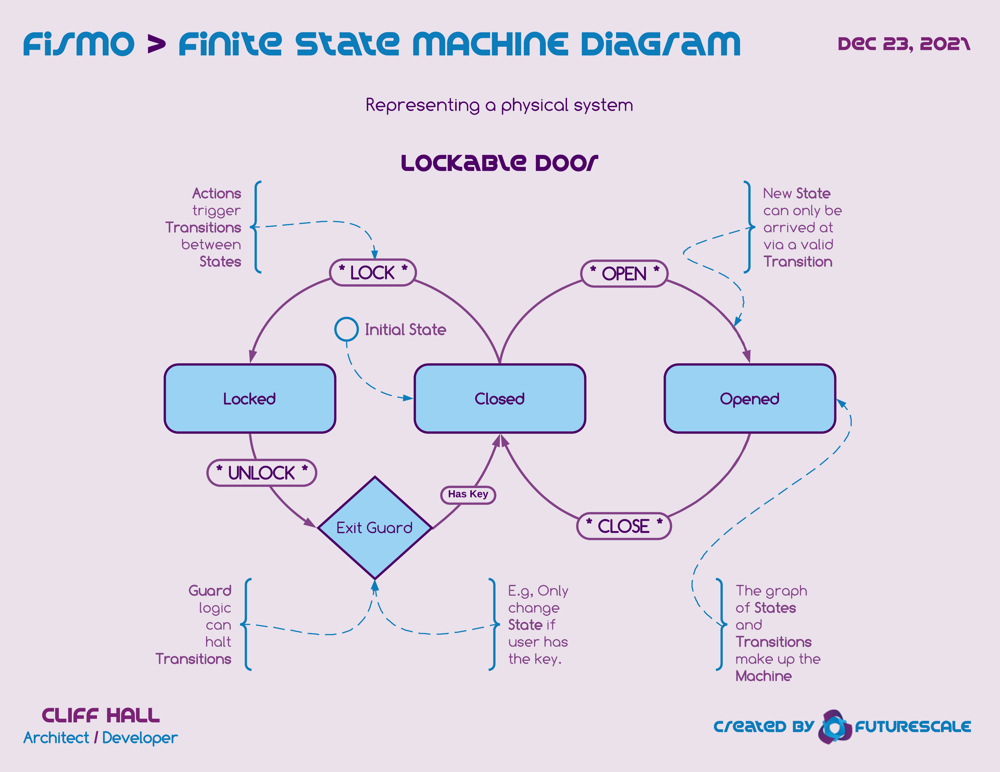

# Fismo
## Multitenant Finite State Machines (FSMs) for Ethereum

### What is an FSM?

- A finite number of _States_, in an interconnected graph. 
  - The edges connecting one State to another is a _Transition_
  - Transitions between States are initiated by _Actions_.
  - Transitions can also have associated _Guard_ logic, triggered on exit or entry to a State.
  
#### Example

#### What can they usefully map to?

As a software pattern, they are frequently used to map processes. A couple of common examples:
  * Software installation wizards; a series of forms or choices with validation rules controlling progress.
  * The myriad steps in a commercial home loan process, each of which has rules about moving to the next phase.

But practically anything that can be described with a graph could be modeled as an FSM. States can represent...
  * Rooms in an dungeon, which an adventurer wanders through, being met with challenges
  * An object such as a door, which could be open, closed, or locked
  * A player's health, such as in hungry state, eating is required before moving to another state
  
### How is Fismo different from other FSM implementations
Most FSM implementations are set up to track state for a single machine.

For instance, even though multiple people may interact with an FSM-based auction contract, it is the current state of 
the auction that's being tracked (pending, open, closed). What the users are allowed to do is based on the state of 
the machine. The user has no "state" to speak of.

Fismo flips all this on it's head. It tracks the state of _each user in every machine they interact with_.

A Machine is a combination of static configuration and guard logic that governs the current state of a user on that machine.

One part is purely configuration...
  * A graph of _states_
  * Valid _transitions_ between states
  * The _actions_ that can trigger _transitions_

The other, much more interesting part is "guard code"...
  * Each state can have an entrance guard; a function that will be called when a user enters a state
  * Each state can have an exit guard; a function that will be called when a user exits a state
  * Passing out of one state and into another, then, could trigger zero through two functions
  * Guard code can do anything, but is so-called because it is a chance to revert the transaction
    - _An adventurer is chained to a post in the middle of the room_
      - They were chained there by a troll when they came into the room. (This happened in the entrance guard logic.)
      - The exit guard for the room can revert if the user's state for the machine representing the chain is "shackled".
      - Some action a user takes in that machine could switch them to the "unshackled" state.
      - Once unshackled, the user can attempt the transition to the other room again.
      - Now the exit guard lets the user pass, and _maybe_ the entrance guard to the next room does as well - who knows?

#### What's in a machine configuration?
* Any number of discrete states.
* The valid transitions to other states and the actions that trigger them.
* Whether proxied guard logic exists for exiting a state.
* Whether proxied guard logic exists for entering a state.
* An offchain metadata URI for each machine that describes this configuration in JSON format.
    - Like NFT metadata, commonly stored on IPFS.
    - Can have longer descriptions than is financially feasible for casual building on-chain.
* Eventually, an on-chain metadata function that returns a bare-bones JSON description of the machine structure:
    - Is possible (see the AvastarsMetadata contract)
    - But no machine, state, transition, or action descriptions other than their names and ids would be included.
    - Could be used to construct client side text or multimedia representations of the machine in question.

#### Fismo.sol, what does it do?
It is a combination of Proxy (for executing guard logic in the context of the Fismo contract), registry of an 
ever-growing machine universe and its users' states within it, and orchestrator of all state transitions.

It maintains...
  * Configurations for any number of named machines.
  * Maintains current state in any number of machines for any number of users.
  * Keeps a history of each user's position (current machine and state)

It executes...
  * Actions that trigger user transitions between states or even machines.
  * Delegates state-specific entrance and exit guard logic to proxied logic contracts.
    - This is similar to the facets of the [Diamond proxy pattern](https://eips.ethereum.org/EIPS/eip-2535).
    - Except, function signatures on proxied logic contracts are...
      - Deterministic. Based on the machine and the states involved in a transition.
      - Example: `MachineName_StateName_Enter(address _user)` or `MachineName_StateName_Enter(address _user)`.
      - Simpler to maintain while avoiding collisions.

It emits events when...
  * A user's state changed in some machine
  * A user is about to exit a state
  * A user is about to enter a state
  * A machine is created
  * A machine is modified
  * A state's guard logic contract is changed

It reverts if...
  * A configured entrance guard returns false
  * A configured exit guard returns false