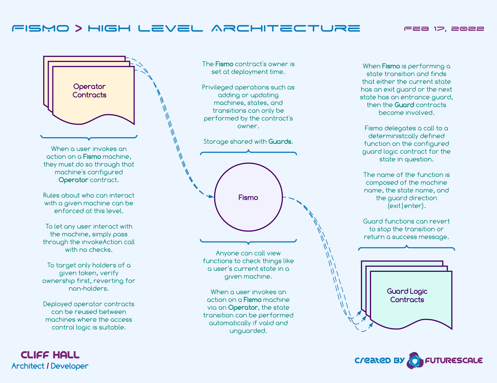

# The Big Picture

## Actors
### Operator
* When a user invokes an action on a Fismo machine, they must do so through that machine's configured Operator contract.

* Rules about who can interact with a given machine can be enforced at this level.  

* To let any user interact with the machine, simply pass through the invokeAction call with no checks.

* To target only holders of a given token, verify ownership first, reverting for non-holders.

* Deployed operator contracts can be reused between machines where the access control logic is suitable.

### Fismo

* The Fismo contract's owner is set at deployment time. 

* Privileged operations such as adding or updating machines, states, and transitions can only be performed by the contract's owner.

* Storage shared with Guards.

* Anyone can call view functions to check things like a user's current state in a given machine.

* When a user invokes an action on a Fismo machine via an Operator, the state transition can be performed automatically if valid and unguarded.

### Guard

* When Fismo is performing a state transition and finds that either the current state has an exit guard or the next state has an entrance guard, then the Guard contracts become involved.

* Fismo delegates a call to a deterministcally defined function on the configured guard logic contract for the state in question. 

* The name of the function is composed of the machine name, the state name, and the guard direction (exit|enter).

* Guard functions can revert to stop the transition or return a success message. 

